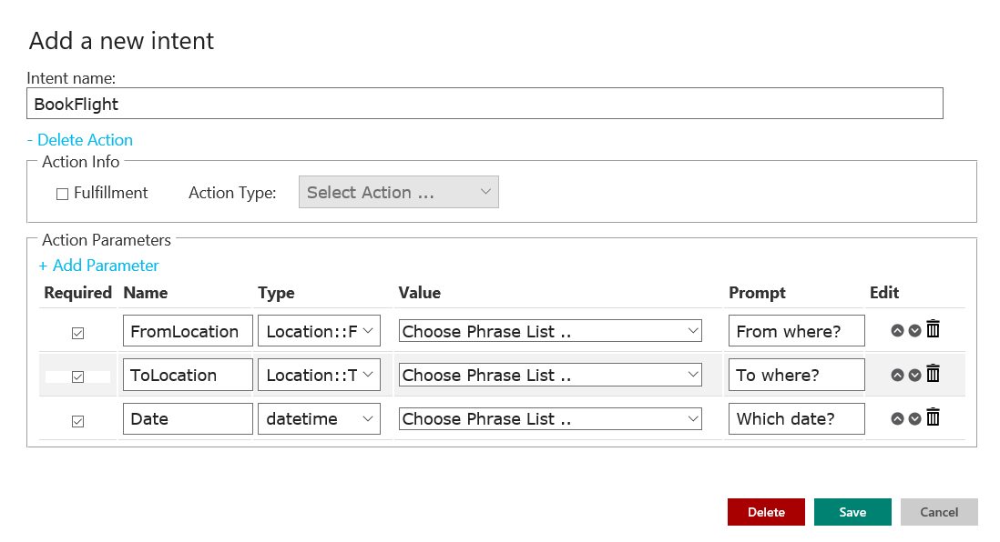

<!-- NavPath: GetStartedLUISAdvanced
LinkLabel: Get Started With LUIS-Advanced
Url: LUIS-api/documentation/GetStartedWithLUIS-Advanced
Weight: 100 -->

#Get Started with LUIS: Advanced Features

######Adding advanced features to your basic LUIS application

###Action Binding

Once a developer creates one or more entities and starts creating intents, he/she can link an intent to an action that specifies requirements for these actions to be triggered. These requirements are known as parameters. LUIS supports only one action per intent. Each action can include a group of parameters derived from entities. The parameter can be optional or required, LUIS assumes that an action is triggered only when all the required parameters are fulfilled. 

###Defining an Action

1. On the Application Editor page, on the left-hand panel, click an existing intent, for example "BookFlight", or create a new one.
2. In the **Add a new intent** dialog box, click **Add Action**.
3. Let us assume this action requires three parameters, "FromLocation", "ToLocation", and "Date".
4. Click **Add Parameter**. Type the name of the parameter, for example "FromLocation", and specify its type from the entities in the "Type" drop-down menu. In this case "FromLocation" is the entity. 
5. Click **Add Parameter** again to add the next parameter, for example "ToLocation" with "ToLocation" being the entity.
6. Add a third parameter "Date" with "datetime" being the entity.
7. Check the **Required** check box next to the name of the parameter that is required for the action to trigger.


**Notes:**
To delete a parameter, click on the trashcan next to its field. To delete an action with its parameters, click **Delete Action** from inside the **Add a new intent** dialog box.

Schematized JSON response

This is a sample extract of the JSON response that is returned when an action is fulfilled: 
"actions": [
        {
          "triggered": true,
          "name": "FindNews",
          "parameters": [
            {
              "name": "Subject",
              "required": true,
              "value": [
                {
                  "entity": "financial crisis",
                  "type": "Topic",
                  "score": 0.8636191
                }
              ]
            },
            {
              "name": "PublicationDate",
              "required": true,
              "value": [
                {
                  "entity": "october 2008",
                  "type": "Date",
                  "score": 0.8523133
                }
              ]
            },
            {
              "name": "Publisher",
              "required": false,
              "value": null
            }
          ]
        }
      ]
    }


Notice that the "Publication Date" and "Subject" required parameters are set to TRUE, which means they are filled in. Thus the action will be triggered as all its required parameters are available. Notice also that the action triggering is set to TRUE. Finally, notice that the "Publisher" parameter is set to FALSE, which means that it is not required for the action to be triggered. 

Action Fulfillment (Preview)

This feature enables you to fulfill the actions that trigged through a set of channels (Full channel list below). For example, if you have the GetWeather intent and the action triggered (all the required parameters were filled), you can actually use the GetCurrentWeather channel to retrieve the weather. 


Follow these steps (see previous screenshot): 
1. In the Application Editor workspace, find Intents in the left-hand menu panel, then click the intent for which you want to bind an action, in this case “Get temperature”. 
2.In the Add a new Intent dialog box, click Add Action. This will open the dialog box as shown in Figure 1.
3.Check Fulfillment in the Action Info sub-section to enable action types.
4.From the Action Type dropdown list select GetCurrentWeather.
5.In the Action Parameters sub-section, click Add Parameter to add a new line.
6. Check the box if the parameter is required, add parameter name, type, value and a text prompt, which is displayed if the parameter is not identified with the intent. (In above screenshot: “required”, “location”, “location”, “locations”, “Which place?”) 
7.In the Action Settings sub-section, map the action to a parameter from the dropdown list, in this case “location”.
8.Click Save to complete and exit.


LUIS is providing a first set of channels and actions, expect more soon.


###Dialog Support (Preview)

LUIS allows you to add conversational interfaces to your applications through a new powerful dialog engine. You can author and execute your dialog in just a few steps. For example, if the user is searching for flights to Paris and typed an utterance without specifying one of the require parameters, "FromLocation", LUIS consequently will send a prompt question "Could you please specify the required departure destination?". Let’s explore how you can build and consume this feature. 

After defining all the parameters needed for action triggering, you now have the ability to add a prompt question, if any of the required parameters is missing. This is where the dialog comes in. 

###Dialog Authoring

1. Click **Go to Preview** in the top ribbon, and then click "BookFlight" intent in the upper left-hand panel. In the **Add a new intent** dialog box, all parameters previously listed in the **Production** mode will be displayed. Note: To return to the **Production** mode, click **Back to Production** in the top ribbon. 
2. Select the **Required** check box next to the name of the parameter that must be present for the action to be triggered. In this way, questions will be prompted when users issue queries that do not include the required parameter. 
3. Specify the parameter value from the phrase lists in the **Value** drop-down list.
 Notes: Phrase lists are not used with pre-built entities.
◦ Phrase lists work with parameters the same way they work with utterances; they are considered features to improve the detection accuracy of parameters in the utterances. 

4. In the **Prompt** text box, type the question to be surfaced when the required parameter is missing. 
5. Use the up and down arrows to define the order in which your application will ask these questions. 
6. Click **Save**. 



###Dialog Execution

Testing the query "BookFlight". Here is the JSON response extract for the dialog response: 

```
        "dialog": 
  {
    "prompt": "From where?",
    "parameterName": "FromLocation::FromLocation",
    "contextId": "09629512-7310-4a9d-9411-57e1d7f8022b",
    "status": "Question"
  }
```
Notes: 
A new dialog section appears at the end of the JSON response. 
Only the top scoring intent is returned in JSON response.


To continue the dialog, append the answer to the question along with the contextID as request parameter. Example: &q=financial crisis &contextId= a144a208-2f1f-4faf-877b-8898ec523022 

Here is the JSON repsonse for the following Dialog question: 
```
    "dialog":  
 {
    "prompt": "Which date?",
    "parameterName": "Date::datetime",
    "contextId": "2e48c7e0-d343-465f-ab0d-03a7598b655f",
    "status": "Question"
  }
```
