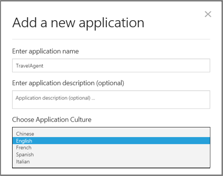

<!-- NavPath: GetStartedLUISbasics
LinkLabel: Get Started With LUIS-Basics
Url: LUIS-api/documentation/GetStartedWithLUIS-Basics
Weight: 100 -->

#Get Started with LUIS: The Basics

LUIS lets you build your applications by using the LUIS web interface. No coding needed other than the ability to interpret and use the returned JSON in your application. It is also possible to use the [LUIS REST API](https://dev.projectoxford.ai/docs/services/56d95961e597ed0f04b76e58/) for automation of applications.

###Using LUIS for the first time

To use LUIS, first make sure that you have an up-to-date version of Microsoft Edge, Internet Explorer or Google Chrome. Go to the home page www.luis.ai and log in. You will see a screen like the one below. 


###Creating your first LUIS Application

All LUIS applications are centered around a domain-specific topic, for example booking of tickets, flights, hotels, rental cars etc. or content related to exercising, tracking fitness efforts and setting goals. You need to decide on a domain-specific topic before you can create your LUIS application. In this case, let's take the example of a virtual travel booking agency application.
In the application, you will bundle together the intents and entities that are important to your task. Two intents relevant to the domain of travel booking are "BookFlight" and "GetWeather". Two entities that are important are "Location" and "DateTime". Once we have identified the intents and entities, we can take an appropriate action, when a user interacts with the application. 

###Step 1: Creating an Application

Click on **My Applications** and then the **New Application** button to create a new application. In the dialog box, name it "TravelAgent". Check that the application culture is set to English. Then click **Add App**. 
 
This creates the application and takes you to the LUIS Application Editor.

###Step 2: Adding entities, intents, and labels

######Defining Entities
  
On the left-hand panel, you will see an option to add entities. We'd like to be able to say what kind of travels we are interested in, and also, for planning purposes, to get an idea of what the weather is like at our travel destination. In order to capture the topic of "location", let's create the entity type: "Location". To do this, click the "**+**" button on the **Entities** bar, and fill in the resulting text entry box for "Location". 

######Hierarchical Entities
  
You now have the ability to define relationships between entities based on hereditary hierarchical patterns. The generic entity acts as the parent and the children are the specific types, or sub-groups, under the parent, yet both share the same characteristics. For example, a generic entity may be called “Location” and the specific children of this parent may be called “ToLocation” and “FromLocation”. “Location”, including its children, has now been transformed from being a generic entity to being a specific entity. The LUIS service can recognize these types when labeling utterances, building models and training them for this entity and its children. 

######Defining Hierarchical Entities
  
Using the “Location” example mentioned above, follow these steps. 

1.	In the Application Editor workspace, find **Entities** in the left-hand menu panel, then click the plus sign.
2.	In the **Add a new Entity** dialog box, type "Location" as the entity name.
3.	Click the plus sign next to the **Entity Children**.
4.	In the text box that appears, type the name of the first child, "ToLocation".
5.	Click the plus sign again to add the second child, “FromLocation”, and so on.
6.	To delete a child, if you made a mistake, click the trash can sign next to the entity child.
7.	When finished, click "**Save**".


######Labeling Children
  
1. Click **New utterance**, then type an utterance like “Book me a flight to Paris”
2. Mark the entity “12 July 2014”, click on the arrow  beside the Parent, Date, Entity to display its children.
3. Select the child entity.
4. Submit the utterance.

######Important Notes

 * You may add up to 10 children types for each parent entity.
 * When adding children, make sure you add them at the same time you are creating the parent entity.
 * To delete an entity with its children, click the entity name at the left-hand panel, and then click "Delete" in the dialog box.

######JSON Response

Below you find an example of the Hierarchical Entities and their children as JSON output. Click "Publish" in the upper left-hand corner of the panel, then click "Update published application". 

1. Set the URL parameter "q" to be your question/utterance, for example, "Book me a flight to Boston on May 4".
2. Hit the "Enter" key or click on the generated URL in the dialog box. 
```
{
  "query": "Book me a flight to Boston on May 4",
  "intents": [
    {
      "intent": "BookFlight",
      "score": 0.979744732
    },
    {
      "intent": "None",
      "score": 0.120113634
    },
    {
      "intent": "GetWeather",
      "score": 9.00356056E-08
    }
  ],
  "entities": [
    {
      "entity": "boston",
      "type": "Location::ToLocation",
      "startIndex": 20,
      "endIndex": 25,
      "score": 0.9935189
    },
    {
      "entity": "may 4",
      "type": "builtin.datetime.date",
      "startIndex": 30,
      "endIndex": 34,
      "resolution": {
        "date": "XXXX-05-04"
      }
    }
  ]
}

```

######Using Bing Entities

Once our app shows a set of news stories, we might want to say something like "Read the second one." This will require understanding ordinal words like "first," "second," and so on. Rather than specifying these by hand, we can use a pre-built entity model called **Ordinals**. Click the button for **Prebuilt Entities** and select **Ordinals** from the dropdown menu. 

######Defining Intents and labeling utterances

Next, we will add two intents to the application. At the top left of the screen, you will see an area for intents. All applications come with one pre-defined intent, **None**. This will recognize user statements that have nothing to do with the application, for example if someone says "How far is it to the moon" to our NewsChat system. 

Go ahead and click **+** next to **Intents**. You'll see a dialog box appear to add a new intent. Enter the intent name of "FindNews", and the example command that triggers the intent as "find news about mars". This will look like the screen below. 

Then click **Save**, and the utterance will be presented for labeling. The intent "FindNews" will already be selected from the intent drop-down. We now need to label the entities present in the utterance. Select the word "mars" (or just click on it) -- it will be highlighted, and you will see a drop-down with the two entities you've defined. 


Click on "Topic", and you'll see the word "mars" highlighted in red, indicating that you've labeled the word "mars" as a "Topic". Now click on **Submit** to submit this label. 

Next, add a second intent called "ShareNews", with the example "send it to wally". Label "wally" as a "Recipient" entity , and click on **Submit**.

Finally, it might be useful to have the app read stories out loud, so let's add a third intent called "Read", with the example "read me the second one". Note how "second" is automatically highlighted as an ordinal pre-built entity. 


###Step 3: Seeding the System

Now that we have a set of intents and entities defined, the next step is to provide some more examples of utterances that illustrate these concepts. Click on the **New Utterances** tab at the top of the screen. Type "Search for news about africa" into the entry box and hit enter. You will see a dropdown box showing the possible intents. Select "FindNews". Note that "africa" is the topic of the news stories we want. Click on "africa" and then select "Topic" from the dropdown box. 

The system needs to be seeded with several examples of each intent, and several examples of each entity. Enter "Share that with Katie", select "ShareNews" as the intent, and label "Katie" as the recipient. Enter "read it" and label that as an example of "Read". As an example of a **None** intent, enter "I like chocolate cake". Now think of several more examples of each intent, and enter them. 

The system has now been seeded with enough data to deploy an initial application. That is done by training and publishing a model.

###Step 4: Training

When you "train" a model, LUIS generalizes from the examples you have labeled, and develops code to recognize the relevant intents and entities in the future. Internally, LUIS uses logistic regression classifiers to determine intents, and conditional random fields (CRFs) to determine the entities. The training process results in optimized classifiers and CRFs, referred to as models, that LUIS can use in the future. To do training, just click the **Train** button at the bottom of the page. Training also automatically occurs periodically. 

###Step 5: Publishing a Model

The next step is to deploy the models to an HTTP endpoint that will interpret the sentences we send it. Click the **Publish** button in the upper left-hand corner, and then **Publish web service** in the resulting window. After a couple of moments, you will see a url that makes your models available as a web service. LUIS will look like the below screenshot.

 

###Summary

You have now built a basic LUIS application.
