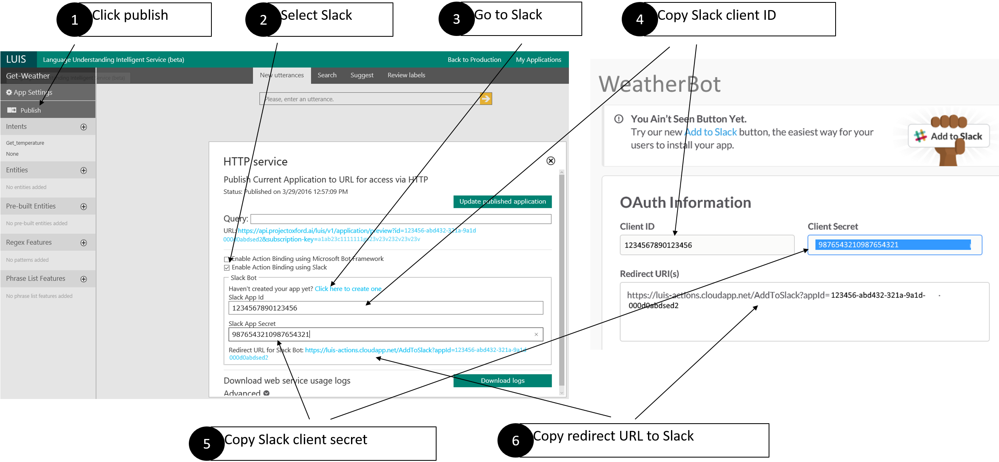

<!-- NavPath: PublishingToBot
LinkLabel: Publishing to a Bot
Url: LUIS-api/documentation/PublishingToABot
Weight: 70 -->

#Slack / Microsoft Bot Framework Integration

There are new options available for publishing LUIS models. These options allow the user to access the language model via various communication channel. The user is able to articulate an intent in slack, via SMS or email (just to name a view) and use this to trigger a bound action, e.g. get temperature or get top news. The result of the called action will show up in the communication channel. Currently, we are offering an integration with: 
 * Microsoft Bot Framework
 * Slack
The Slack integration is a direct integration with a slack bot while the Microsoft Bot Framework wraps around several other communication channel including Slack. 

###Using the Microsoft Bot Framework

The Microsoft Bot Framework  enables users to build and connect intelligent bots to interact with your users naturally wherever they are, from text/sms to Skype, Slack, Office365 mail to other popular services. In combination with LUIS the user can use the Bot Framework to enable triggering actions via any popular communication channel in an easy way. The user simply has to create a new bot in the MS Bot Framework and then configure LUIS the right way to enable calling one side to the other. 

Here is how you can set up a bot in the MS Bot Framework in a few steps (see previous screenshot): 
1. When you click on publish you will get to a dialog
2. On this dialog you can select “Enabling Action binding using Microsoft Bot Framework”
3. The link in the field brings you to the webpage where you can create your bot. You can register a new bot there.
4. When this is done please copy over the App ID
5. Copy also the App secret into the correct field in the publish dialog of LUIS.
6. Finally, copy over the redirect URL provided by LUIS to your app. Unfortunately, you need this URL already during the registration step.
When this configuration is done and the application is correctly created within the Bot Framework. In the framework there are additional steps required to enable various channels. Please follow the instructions there if you want to enable SMS or Slack. 

Using the direct Slack connection

Slack is a communication platform for teams and it is getting more and more traction. For LUIS action binding we are providing a slack bot connector which you can configure with a few clicks to make it available for your teams. You just have to configure it in a way that LUIS can talk to your bot. The configuration is handling all handshaking for you. To create a bot in Slack please follow the instructions on  

Here is how you can set up a Slack bot in a few steps (see above screenshot): 
1. When you click on publish you will get to a dialog.
2. On this dialog you can select “Enabling Action binding using Slack”.
3. The link in the field brings you to Slack where you can create your Slack app and bot. Please go there and create your app there.
4. When this is done please copy over the client ID from your new Slack app.
5. Copy also the client secret into the correct field in the publish dialog of LUIS. This enables Slack to call LUIS and make use of the language understanding.
6. Finally, copy over the redirect URL provided by LUIS to your Slack app. This enables your app to call the bound action in LUIS.

When this configuration is done and the application is correctly created in Slack you can use a bot within your team conversation. Just try a few utterances and see if the bot replies to you. 

